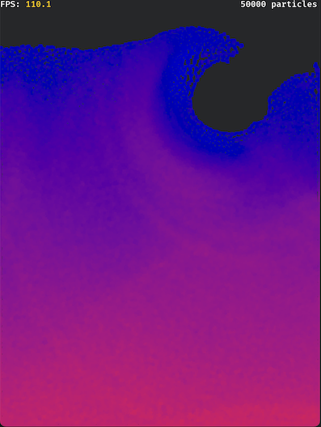
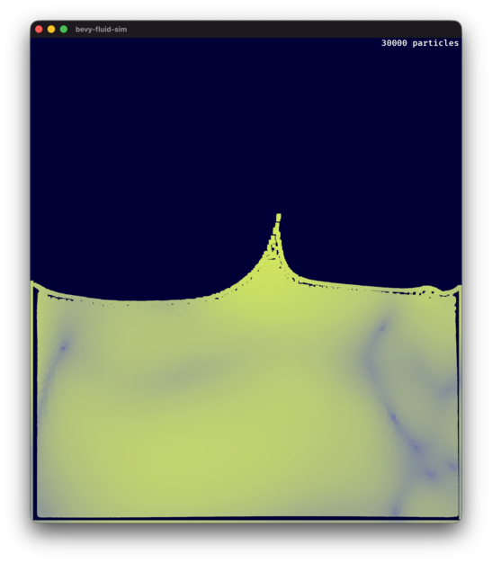

# Bevy Fluid Sim

I've wanted to mess around with fluid simulation (aka SPH, Smoothed Particle
Hydrodynamics) for ages, ever since playing
[PixelJunk Shooter](https://en.wikipedia.org/wiki/PixelJunk_Shooter)
back in 2009.

I made a stab at it with Unity in 2012 or thereabout, but it turned into more
of a planetary orbits simulation than a fluid simulation. I never got around
to figuring out the math before I lost interest.

## Along came "Coding Adventure: Simulating Fluids"

Recently I came across
[this excellent video](https://www.youtube.com/watch?v=rSKMYc1CQHE)
by Sebastian Lague, and it rekindled my interest. Naturally,
since I've been obsessed with Rust for the past couple of years, I decided
to give it a go in Rust using the [Bevy game engine](https://bevyengine.org/).

## Early Results

After wrestling with it for a couple of weeks, I achieved something that
looks... fluid adjacent.

.

## Update, April 2026

Almost 2 years later, I revisited this project and undid some of my
math goofs, tuned and re-tuned the various parameters, and finally have
something much more fluid-like. I also added real viscosity (just copied
straight from the video), instead of the temporary speed limit hack in the
original.

It's still very dependent on the right choice of values for several parameters,
but it's getting better.



# Running the App

If you use RustRover as your IDE, you can run the app with no special steps
necessary. The following info is related to running from the command line.

## Dynamically-Linked Build for Development

To speed up compiling (world record understatement), I use the `dynamic_linking`
bevy feature. Therefore, running the app requires telling it where to find
the shared libraries.

### Mac

Basically, for every `Library not loaded: @rpath/xxx.dylib`
error, you need to find where this library is located, and add it to
the `DYLD_FALLBACK_LIBRARY_PATH` environment variable.

Example:

```
libstd_loc=$(find $HOME/.rustup -name libstd-9a8d4c925c11f507.dylib)
DYLD_FALLBACK_LIBRARY_PATH=$(libstd_loc) ./target/release/bevy-fluid-sim
```

### Windows

```
PATH=%USERPROFILE%\.rustup\toolchains\stable-x86_64-pc-windows-msvc\bin\;.\target\debug\deps\;.\target\release\deps
.\target\release\bevy-fluid-sim.exe
```

## Statically-Linked Build

However, to build a version of the binary that doesn't require the above
trickery, just run:

```bash
cargo build --release --no-default-features
```

It takes substantially longer (around 10 minutes, last I checked), so
you'll understand the reason for the dynamic builds during development.
